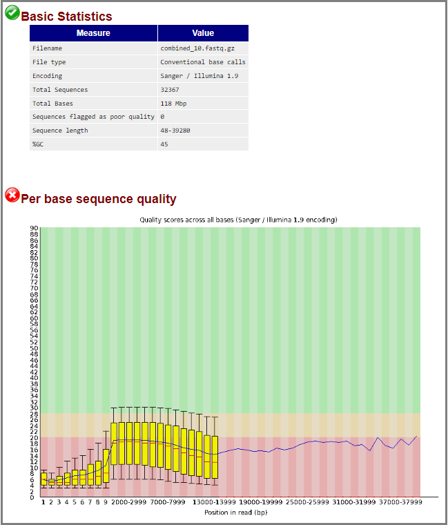
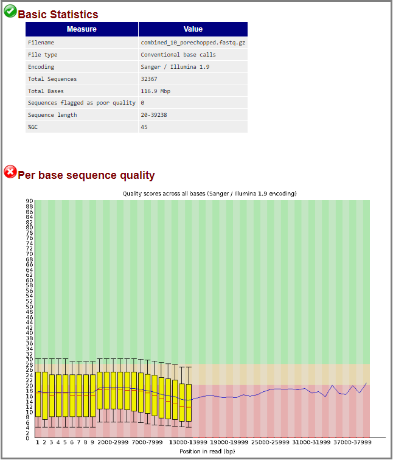
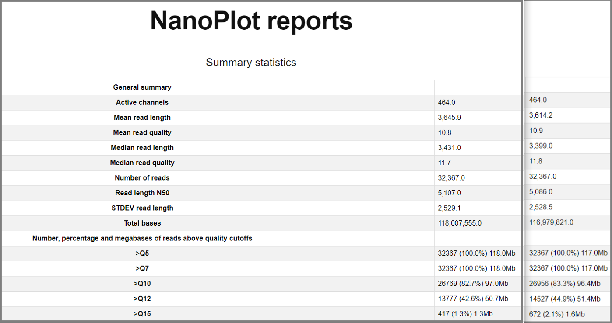
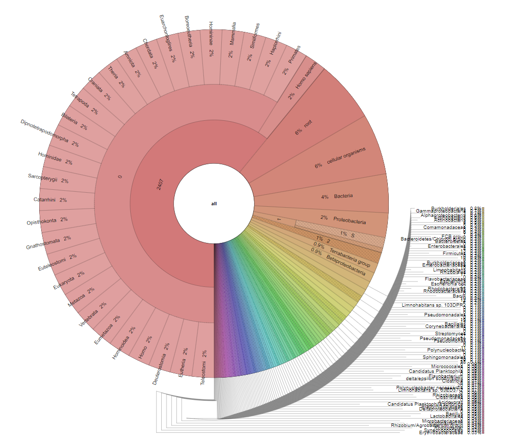

```{r general setup, include=FALSE}
knitr::opts_chunk$set(echo = TRUE)

```

<br><br>

--------------------------------------------------
--------------------------------------------------

# Introduction

This pipeline is designed for analyzing Next-Generation Sequencing data. The raw data used for testing this pipeline originate from two separate ONT MinION long-read, single-end shotgun DNA-sequencing experiments on ditch water using R9.4.1 flow-cells, presented in fastq format. This Markdown document will therefore use the ditch water experiment data to guide the reader through the analysis pipeline. The point of this pipeline, however, is that data from any other similar sequencing experiment can be used as input. The end result will be a comprehensive overview of microbe composition in origin samples, supported by multiple instances of quality control. 

Note: this markdown document is aimed at people with limited to zero command line experience.

Note: phrases in **bold** specify commands; phrases in *italics* specify scripts.
<br>

### Contents

[inhoudsopgave]
<br>

### Environment setup:

To properly run this pipeline, a number of 'packages' needs to be installed first. These packages are available online and contain the code necessary to execute all downstream scripts and commands. The 'conda' package management system is used to install these packages to a specific 'conda environment', which will help avoid conflicts with other programs present on the server.

**conda update** updates the conda system; it is good practice to update first.<br>
**conda create [name_of_environment]** will create a new environment.<br>
**conda activate [name_of_environment]** will switch the active working directory to that environment and thus activate all installed packages.<br>
**conda install [name_of_package]** will install packages to the currently active conda environment.

For this pipeline, the 'meta' conda environment is created and configured as follows:


```{bash conda environment setup, echo=TRUE, eval=FALSE}

# update conda; 'echo "y"' will automatically answer a confirmation prompt:

echo "y" | conda update -n base conda

# create meta environment:

conda create meta

# activate conda meta environment:

conda activate meta

# install all packages necessary for downstream scripts and commands:

echo "y" | conda install fastqc
echo "y" | conda install Porechop
echo "y" | conda install NanoPlot
echo "y" | conda install krona
echo "y" | conda install minimap2
echo "y" | conda install bowtie2
echo "y" | conda install [...]

```

Note: The currently active conda environment is always displayed in the terminal between brackets at the start of each line.
<br>

### Library setup:

[blabla]

```{r library setup}

# load libraries:
# ...

```
<br>

### Working directory

The working directory with all the necessary files can be found here: home/1790915/Metagen_SW. Scripts will not work from other directories unless the path is specified. Change your directory with **cd /home/data/1790915/Metagen_SW**. Then check the current working directory with **pwd**. The virtual workspace is now properly set up.
<br>

### About scripts

The next section contains the first bash script. These scripts can simply be run from the terminal. However, most scripts need to know where to find their input data, and where to store their output file(s), among other variables. The scripts are designed so that the user may provide these variables as options. Use **bash [script_name.sh] -h** to print an overview of a script's function and usage. This works for all bash scripts down the line.<br><br><br>

--------------------------------------------------
--------------------------------------------------

# Raw sequencing data overview

The raw data from the ditch water project can be found on the HU server: /home/data/projecticum/SW/raw_data. There are 288 separate .fastq.gz files. For the purposes of testing the pipeline, a subset of 10 files is created. The following files are chosen through random number generation:

fastq_runid_49[...]_17_0.fastq.gz<br>
fastq_runid_49[...]_29_0.fastq.gz<br>
fastq_runid_49[...]_56_0.fastq.gz<br>
fastq_runid_49[...]_78_0.fastq.gz<br>
fastq_runid_49[...]_88_0.fastq.gz<br>
fastq_runid_49[...]_115_0.fastq.gz<br>
fastq_runid_49[...]_173_0.fastq.gz<br>
fastq_runid_49[...]_202_0.fastq.gz<br>
fastq_runid_e0[...]_16_0.fastq.gz<br>
fastq_runid_e0[...]_40_0.fastq.gz

These files are copied from the server, and concatenated (combined) into one .fastq.gz file:

```{bash server files, echo=TRUE, eval=FALSE}

# copy the specified files from the server to the raw_data folder:

cp /home/data/projecticum/SW/raw_data/fastq_runid_49*_17_0.fastq.gz ../raw_data
cp /home/data/projecticum/SW/raw_data/fastq_runid_49*_29_0.fastq.gz ../raw_data
cp /home/data/projecticum/SW/raw_data/fastq_runid_49*_56_0.fastq.gz ../raw_data
cp /home/data/projecticum/SW/raw_data/fastq_runid_49*_78_0.fastq.gz ../raw_data
cp /home/data/projecticum/SW/raw_data/fastq_runid_49*_88_0.fastq.gz ../raw_data
cp /home/data/projecticum/SW/raw_data/fastq_runid_49*_115_0.fastq.gz ../raw_data
cp /home/data/projecticum/SW/raw_data/fastq_runid_49*_117_0.fastq.gz ../raw_data
cp /home/data/projecticum/SW/raw_data/fastq_runid_49*_202_0.fastq.gz ../raw_data
cp /home/data/projecticum/SW/raw_data/fastq_runid_e0*_16_0.fastq.gz ../raw_data
cp /home/data/projecticum/SW/raw_data/fastq_runid_e0*_40_0.fastq.gz ../raw_data

# concatenate into one file:

zcat /raw_data/fastq_runid* > test10.fastq

# compress to limit disk space:
 
gzip /raw_data/test10.fastq

# remove the copied (separate) fastq files:

rm /raw_data/fastq_runid*

```

```{bash server files zcat, echo=TRUE, eval=TRUE}

# check the combined file's format by viewing part of the first read:

zcat raw_data/test10.fastq.gz | head -n4 | cut -c1-400

# it should look something like this:

```
<br>

The first line in the read shows the metadata, specifically the type of sequencing experiment the data originates from (in this case R9.4.1 MinION, DNA). 
If your data does not provide clear metadata, a quick summary report can be created through the *FASTQ_summarizer.sh* script. 

```{bash FASTQ summary, echo=TRUE, eval=FALSE}

# print the FASTQ_summarizer.sh script function and usage (optional):

bash FASTQ_summarizer.sh -h

# execute the script with proper flags:

bash FASTQ_summarizer.sh \
-I raw_data              \
-O analyse/analyse_misc

```

```{bash FASTQ summary cat, echo=TRUE, eval=TRUE}

# open summary report:

cat analyse/analyse_misc/FASTQ_summary.txt

# the report looks like this:

```

The "longest read length" result provides insight in the type of sequencing data: if this result is 300 basecalls or less, it would be a strong indication that the raw data originates from Illumina short-read sequencing instead of long-read sequencing.<br><br><br>

--------------------------------------------------
--------------------------------------------------

# Initial quality control

### FastQC on raw data subset

The FastQC tool will be used to get a quick qualitative overview using the basecall-linked Phred-scores in the dataset. The *FASTQC_reporter.sh* script takes FASTQ data, analyzes the quality scores and creates an html report. The report consists of a number of graphs that will be discussed further. 

```{bash FastQC, echo=TRUE, eval=FALSE}

# print the fastqc tool description (optional):

fastqc -h

# print the FASTQC_reporter.sh script function and usage (optional):

bash FASTQC_reporter.sh -h

# execute the script with proper flags:

bash FASTQC_reporter.sh \
-I raw_data             \
-O analyse/FastQC

```

Open the html report by navigating to the output directory with **cd ~/Metagen_SW/analyse/FastQC**, then click on the .html file and choose 'View in Web Browser'. The "Basic Statistics" section of the FastQC report shows an overview of the metadata. This should correspond with the *FASTQ_summarizer.sh* results from earlier.



<br>The boxplots in the "Per base sequence quality" graph represent the quality values of the entire input per basecall 'location' in the reads, i.e. the quality scores of the first base of each read combined are represented by the first box. Results of this analysis can be used down the line to trim reads in order to obtain a subset of higher average quality.

Note: FastQC is originally designed for analyzing Illumina or Sanger short read sequencing data. The "Encoding" measurement under "Basic Statistics" should confirm this. Phred scores from short read sequencing are expected to be much higher than those of Nanopore long reads. Phred scores for Nanopore MinION R9.4.1 experiments should preferably be > 8. The color-coding in the "Per base sequence quality" graph should therefore not be taken into account.
<br>

### Porechop adapter trimming

ONT uses certain adapters to assist with sequencing experiments. The 'Porechop' tool is developed to find and excise many of these adapter sequences in fastq files. the Porechop tool can be used as follows:

```{bash porechop, echo=TRUE, eval=FALSE}

# print the porechop description (optional):

porechop -h

# execute porechop with proper flags; note that porechop takes files instead of directories as in- and output:

porechop                            \
-i raw_data/test10.fastq.gz         \
-o bewerkte_data/test10_pc.fastq.gz

```

Porechop progress can be viewed in the terminal while the tool is running. After the trimming is complete, check the results by running FastQC on the trimmed data:

```{bash porechopped FastQC, echo=TRUE, eval=FALSE}

# execute the FastQC_reporter.sh script again, with the trimmed data as input:

bash FASTQC_reporter.sh \
-I bewerkte_data        \
-O analyse/FastQC

```

Open the new html report and compare the "Per base sequence quality" with the earlier report. 



<br>In this example, the low-quality basecalls initially seen in figure 1 have been trimmed off by porechop, increasing the overall quality of the data.
<br>

### NanoPlot analysis

The total average Phred-scores per input, among other values, can be calculated using the NanoPlot tool. The *FASTQ_NanoPlotter.sh* script can calculate Phred-score averages for both the original subset and the Porechop-trimmed subset.

```{bash NanoPlot, echo=TRUE, eval=FALSE}

# print the nanoplot tool description (optional):

NanoPlot -h 

# print the FASTQ_NanoPlotter.sh script function and usage (optional):

bash FASTQ_NanoPlotter.sh -h

# execute the script with proper flags on the original subset:

bash FASTQ_NanoPlotter.sh \
-I raw_data               \
-O analyse/NanoPlot

# execute the script with proper flags on the Porechop-trimmed subset:

bash FASTQ_NanoPlotter.sh \
-I bewerkte_data          \
-O analyse/NanoPlot

```



<br>As shown, the average read quality increased (slightly) after trimming away adapter sequences using the porechop tool.<br><br><br>

--------------------------------------------------
--------------------------------------------------

# Taxonomy

### Kraken2 classification

The cleaned data can now be used as input for taxonomic analysis. Taxonomy will be done using the Kraken tools suite, including Kraken2, Bracken and Pavian (https://www.nature.com/articles/s41596-022-00738-y). BowTie2 can optionally be used if the results show contamination of human origin.

Kraken2 uses *k*-mer analysis and large genome databases in order to assign reads to specific species. Since the broadest databases require 700+ GB, there are various 'mini' databases available with much lower processing requirements. However, this means that more sample reads might be labeled as unclassified.

(See also https://github.com/DerrickWood/kraken2/blob/master/docs/MANUAL.markdown.)

For this project, the *Kraken2_classifier.sh* script is written using the (((MINIKRAKEN OP SERVER, wordt nog vervangen))) database (((REDEN))). It can be executed as follows.

```{bash Kraken2, eacho=TRUE, eval=FALSE}

# print the kraken2 tool description (optional):

kraken2 -h

# print the Kraken2_classifier.sh script function and usage (optional):

bash Kraken2_classifier.sh -h

# execute the script with proper flags:

bash Kraken2_classifier.sh                                    \
-i ~/Metagen_SW/bewerkte_data/test10_pc.fastq.gz              \ 
-O ~/Metagen_SW/analyse/Kraken2/                              \
-d /home/daur2/metagenomics/minikraken2_v2_8GB_201904_UPDATE/

```

<br>The script will save the results to the newly made analyse/Kraken2 folder. The "test10_pc.report" file shows the complete taxonomy of all reads in the input file, with representation in percentages (%) in the first column. The overall percentages of classified and unclassified ("U") reads can be seen in the first two lines of this document. 

```{bash kraken2 cat, echo=TRUE, eval=TRUE}

cat analyse/Kraken2/test10_pc.report | head -n2

```


### Bracken abundance estimation

To give a better representation of the actual microbial composition of the sample, the Kraken2 output is used as input for the Bracken tool, which estimates species abundances.

```{bash bracken, echo=TRUE, eval=FALSE}

bracken                                                       \
-d /home/daur2/metagenomics/minikraken2_v2_8GB_201904_UPDATE/ \
-i ~/Metagen_SW/analyse/Kraken2/test10_pc.report              \
-o ~/Metagen_SW/analyse/bracken/test10_pc.bracken

```


### Krona species visualization

The Bracken report output can be visualized using the Krona tool.

```{bash Krona, echo=TRUE, eval=FALSE}

ktImportText                                               \
-o Krona_output.html                                       \
~/Metagen/analyse/Bracken/test10_pc_bracken_species.report

# nog aanpassen:
## aanpassen naar script 
## ouput naar juiste folders 
## homo sapiens (2%) reads verwijderen (BowTie2)
## alles <x% samenvoegen als 'other'

```



<br><br><br>

### Minimap2 host sequence removal

As seen in the Krona results, homo sapiens is represented in the chart. In fact, the entire upper-left (red) area is reserved for the human species. This indicates human contamination of the sample during preparation and sequencing. In other experiments, for example when analyzing metagenomic samples from the human gut, human DNA is expected to be present in high amounts. In both cases, human DNA can be removed by first aligning the sample to a human reference genome using the minimap2 tool. This tool compares reads to a specific reference genome (human), after which the unaligned reads can be selected, thus cleaning up irrelevant data. BowTie2 is another tool for reference alignment and for host DNA removal, except it is more suited for Phred-scores >33 from Illumina sequencing.

```{bash minimap2 host sequence removal, echo=TRUE, eval=FALSE}

# get GRCh38 human genome reference

cd ~/Metagen_SW/referentie

wget ftp://ftp.ncbi.nlm.nih.gov/genomes/all/GCA/000/001/405/GCA_000001405.15_GRCh38/seqs_for_alignment_pipelines.ucsc_ids/GCA_000001405.15_GRCh38_no_alt_analysis_set.fna.gz

# create minimap2 GRCh38 reference index:

minimap2                                              \
-x map-ont                                            \
-d GRCh38_noalt_index.mmi                             \
GCA_000001405.15_GRCh38_no_alt_analysis_set.fna.gz    

# minimap2 alignment to GRCh38 (output as SAM-file):

minimap2                                              \
-a                                                    \
-x map-ont                                            \
-t 4 GRCh38_noalt_index.mmi                           \    
~/Metagen_SW/bewerkte_data/test10_pc.fastq.gz >       \
~/Metagen_SW/bewerkte_data/test10_pc.sam        

# select unaligned reads and convert SAM to BAM:

samtools view                                         \
-b                                                    \
-f 4                                                  \
~/Metagen_SW/bewerkte_data/test10_pc.sam >            \
~/Metagen_SW/bewerkte_data/test10_pc_nh.bam   

# convert BAM to fastq.gz for downstream use (Kraken2):

samtools fastq                                        \
test10_pc_nh.bam >                                    \
test10_pc_nh.fastq.gz

```

.....
testing

# dit geeft bam in bewerkte_data [bewerkte_data/output.bam, bewerkte_data/output.bam.bai]:
minimap2 -a -x map-ont -xsr ../referentie/GCA_000001405.15_GRCh38_no_alt_plus_hs38d1_analysis_set.fna.gz ../bewerkte_data/test10_pc.fastq.gz | samtools view -bh | samtools sort -o output.bam

# dit geeft non-host output in fastq.gz [bewerkte_data/test10_pc_nh.fsatq.gz]:
samtools fastq -f 4 -F 1 output.bam | gzip -c > test10_pc_nh.fastq.gz

# dan kraken2:
bash Kraken2_classifier.sh -i ../bewerkte_data/test10_pc_nh.fastq.gz -O ../analyse/Kraken2/ -d /home/daur2/metagenomics/minikraken2_v2_8GB_201904_UPDATE/

# dan bracken:
bash Bracken_estimator.sh -i ../analyse/Kraken2/test10_pc_nh.report -O ../analyse/Bracken/ -d /home/daur2/metagenomics/minikraken2_v2_8GB_201904_UPDATE/

# dan krona:
ktImportText -o test10_pc_nh_krona.html ../analyse/Bracken/test10_pc_nh_bracken_species.report

# RESULTAAT: beter maar nog steeds veel human. Zie analyse/Krona.

.....
testing2

# alle stappen staan hier:
https://hackmd.io/@AstrobioMike/kraken2-human-read-removal#Human-read-removal-with-kraken2

# directory:
temp/kraken2_human_db

# kraken2-build doet niet, dus downloaden met: 
curl -L -o kraken2_human_db.tar.gz https://ndownloader.figshare.com/files/23567780
...
tar -xzvf kraken2_human_db.tar.gz

# kraken2 met o.a. de unclassified (t.o.v. human) fastq als output:
kraken2 --db kraken2_human_db/ --threads 4 --output ~/Metagen_SW/analyse/Kraken2/test10_pc_nh_hackmdio_out.txt --report ~/Metagen_SW/analyse/Kraken2/test10_pc_nh_hackmdio_report.txt --unclassified-out ~/Metagen_SW/bewerkte_data/test10_pc_nh_hackmdio_unclassified.fq ~/Metagen_SW/bewerkte_data/test10_pc.fastq.gz

# zip:
gzip bewerkte_data/test10_pc_nh_hackmdio_unclassified.fq

