```{r general setup, include=FALSE}

knitr::opts_chunk$set(echo = TRUE)

```

--------------------------------------------------
--------------------------------------------------

# Contents

<br>**Chapter 1**: Introduction
<br>  1.1: Working directory setup
<br>  1.2: Environment setup
<br>  1.3: About scripts
<br><br>**Chapter 2**: Selecting raw sequencing data for pipeline testing
<br><br>**Chapter 3**: Initial quality control
<br>  3.1: FastQC analysis on raw data
<br>  3.2: NanoPlot analysis on raw data
<br><br>**Chapter 4**: Taxonomy -- unmodified classification
<br><br>**Chapter 5**: Taxonomy -- parameter adjustments
<br>  5.1: Expanding the Kraken2 database
<br>  5.2: Increasing the minimum Phred-quality score threshold
<br>  5.3: ONT-adapter trimming
<br>  5.4: Filtering on read length
<br><br>**Chapter 6**: Abundance estimation
<br><br>**Chapter 7**: Visualization of microbial composition
<br><br>**Chapter 8**: Validation
<br>  8.1: Positive control
<br>  8.2: Positive control workflow
<br>  8.3: Positive control results
<br>  8.4: Negative control
<br>  8.5: Negative control workflow
<br>  8.6: Negative control results
<br><br>**Chapter 9**: Pipeline overview and conclusions 
<br><br>**Chapter 10**: Considerations and future improvements

--------------------------------------------------
--------------------------------------------------

# 1: Introduction

This pipeline is designed for analyzing Next-Generation Sequencing data. The raw data used for testing this pipeline originate from two separate ONT MinION long-read, single-end shotgun DNA-sequencing experiments on ditch water using R9.4.1 flow-cells, presented in fastq format. This Markdown document will therefore use the ditch water experiment data to guide the reader through the analysis pipeline. The point of this pipeline, however, is that data from other sequencing experiments, from various environments can be used as input. The final output of this pipeline will be a comprehensive and quality controlled overview of microbe composition found in the inputdata. This markdown document is aimed at people with limited to zero command line experience.


### 1.1: Working directory setup

To follow along with this analysis pipeline, it is important to follow the same folder hierarchy. Create the (empty) folders in the home-folder, and select the future working directory as follows:

```{bash directory setup, echo=TRUE, eval=FALSE}

# navigate to your home folder:

cd ~

# create folder hierarchy:

mkdir -p Metagen_SW/{analyse,bewerkte_data,control,raw_data,referentie,scripts}

# navigate to the Metagen_SW directory, from which the rest of the pipeline will be executed:

cd Metagen_SW

```

### 1.2: Environment setup

To properly run this pipeline, a number of 'packages' needs to be installed first. These packages are available online and contain the code necessary to execute most downstream scripts and commands. The 'conda' package management system is used to install these packages to a specific 'conda environment', which will help avoid possible conflicts with other programs present on the server. In this case, the 'meta' conda environment is created and configured as follows:

```{bash conda environment setup, echo=TRUE, eval=FALSE}

# update conda, as this is good and reliable practice; 'echo "y"' will automatically answer the update confirmation prompt:

echo "y" | conda update -n base conda

# create meta environment:

conda create meta

# activate conda meta environment; note that this command needs to be executed each time the terminal is closed:

conda activate meta

# install all packages necessary for downstream scripts and commands; again 'echo "y"' to confirm installation:

echo "y" | conda install bracken
echo "y" | conda install fastqc
echo "y" | conda install kraken2
echo "y" | conda install krona
echo "y" | conda install nanoplot
echo "y" | conda install porechop
echo "y" | conda install sra-tools

# create one more environment for NanoFilt analysis to avoid dependency issues (introduced later):

conda create nanofilt_env
conda activate nanofilt_env

echo "y" | conda install libstdcxx-devel_linux-64
echo "y" | conda install nanofilt

# return to main environment:

conda activate meta

```

### 1.3: About scripts

The next section contains the first bash script. These scripts can simply be run from the terminal. However, most scripts need to know where to find their input data, and where to store their output file(s), among other variables. The scripts are designed so that the user may provide these variables as options. Use **bash [script_name.sh] -h** to print an overview of a script's function and usage. This works for all bash scripts down the line.

--------------------------------------------------
--------------------------------------------------

# 2: Selecting raw sequencing data for pipeline testing

The raw data from the ditch water project can be found on the HU server: /home/data/projecticum/SW/raw_data. There are 288 separate fastq files, which are copied from the server and concatenated (combined) into one fastq file:

```{bash server files, echo=TRUE, eval=FALSE}

# copy the raw data files from the server to the raw_data folder:

cp /home/data/projecticum/SW/raw_data/fastq*.fastq.gz raw_data

# concatenate into one file:

zcat raw_data/fastq*fastq.gz > SW.fastq
mv SW.fastq raw/data

# compress to limit disk space:
 
gzip raw_data/SW.fastq

# remove the separate fastq files:

rm raw_data/fastq*fastq.gz

```

```{bash server files view, echo=TRUE, eval=TRUE}

# check the combined file's format by viewing part of the first read:

zcat raw_data/SW.fastq.gz | head -n4 | cut -c1-300

# it should look like this:

```

Each 4 lines in fastq represent information for a single read:
<br><br>Line 1: metadata from the sequencing experiment (in this case DNA-sequencing with R9.4.1 ONT MinION flow-cells);
<br>Line 2: basecalls (A, C, G, T);
<br>Line 3: separator ("+" symbol);
<br>Line 4: Phred-quality scores in ASCII corresponding to basecalls.

--------------------------------------------------
--------------------------------------------------

# 3: Initial quality control

### 3.1: FastQC analysis on raw data

The FastQC tool will be used to get a quick qualitative overview using the basecall-linked Phred-scores in the dataset. The *fastqc_reporter.sh* script takes fastq data, analyzes the quality scores and creates an html report. The report consists of a number of graphs that will be discussed further. The most important results will show average quality scores per base location in the input reads.

```{bash FastQC, echo=TRUE, eval=FALSE}

# print the fastqc tool description (optional):

fastqc -h

# print the fastqc_reporter.sh script function and usage (optional):

bash scripts/fastqc_reporter.sh -h

# execute the script with proper flags:

bash fastqc_reporter.sh \
-I raw_data             \
-O analyse/fastqc

```

Open the html report by navigating to the output directory and viewing the html in a web browser. The "Basic Statistics" section of the FastQC report shows an overview of the metadata.

![Figure 1: summary of FastQC report on SW.fastq.gz without further adjustments. Results of this analysis will be compared with results after manipulating the input data and adjusting input parameters. Note that FastQC was originally designed for analyzing Illumina or Sanger short read sequencing data. The "Encoding" measurement under "Basic Statistics" should confirm this. Phred scores from short read sequencing are expected to be much higher than those of Nanopore long reads. Phred scores for Nanopore MinION R9.4.1 experiments should preferably be > 8. The color-coding in the "Per base sequence quality" graph should therefore not be taken into account.](misc/SW_fastqc.PNG)

<br>The box-and-whisker-plots in the "Per base sequence quality" graph represent the quality values of the entire input per basecall 'location' in the reads, i.e. the quality scores of each first base in the reads combined are represented by the first box. For NanoPore MinION R9.4.1 sequencing, using only data with quality scores of >7 is recommended by ONT, while other more scrutinizing literature accepts only >10 (Delahaye and Nicolas, 2021). Despite comparatively high error rates, the R9.4.1 flow-cell can still generate data with >97% accuracy, corresponding to a Phred-score of 16 (Ni et al, 2023). The ditch water results show that the average Phred-scores are low at the start and near the ends of the reads, while the middle part of the graph shows average quality scores to be around 12 to 18. Therefore, the next goal of this pipeline is to manipulate the raw data by filtering/trimming away the reads that cause the lower quality at the beginnings and ends. To determine parameters for filtering out low-quality reads, first the correlation between read length and read quality will be examined. NanoPore is designed for generating long read data, however the FastQC summary shows that reads as short as 34 bases have been detected. The sequence length distribution graph also suggests many short reads to be present in the data. 

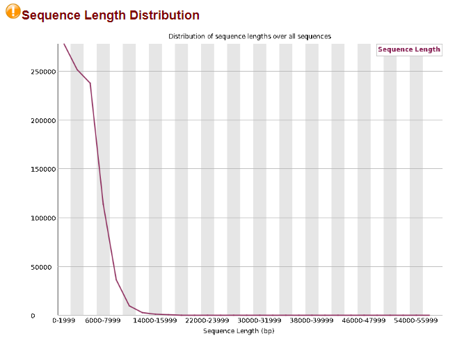

### 3.2: NanoPlot analysis on raw data

For finding possible correlations between read length and read quality, the NanoPlot tool can be used through the *fastq_nanoplotter.sh* script. The report gives summary statistics and plots with regards to quality scores.

```{bash NanoPlot, echo=TRUE, eval=FALSE}

# print the nanoplot tool description (optional):

NanoPlot -h 

# print the fastq_nanoplotter.sh script function and usage (optional):

bash scripts/fastq_nanoplotter.sh -h

# execute the script with proper flags on the file in raw_data:

bash scripts/fastq_nanoplotter.sh \
-I raw_data                       \
-O analyse/nanoplot

```

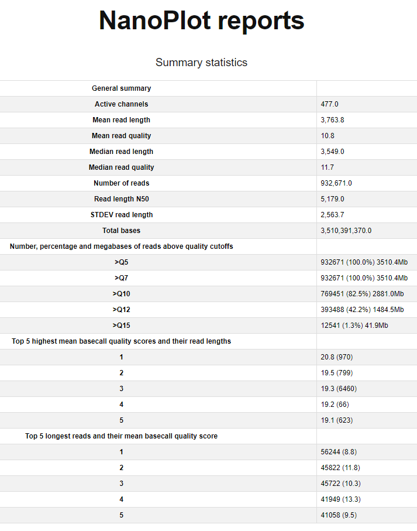

<br>Whereas FastQC analysis is focused on average score differences depending on basecall location in the reads, the NanoPlot summary statistics table gives insight into the quality of the reads in relation to their lengths. Important are the following details:
<br>1. Mean read quality: The mean quality of the complete ditch water data is 10.8. A higher average was expected based on the FastQC sequence quality graph, however this discrepancy suggests that the 'binning' of the boxplots kept more low quality reads hidden between basecall 9 and 3000.
<br>2. Quality cutoffs: this shows which portion of the total number of reads falls above the specified quality cutoff. In this case, 100% of the reads have quality scores of Q>7, while 82.5% have Q>10. This indicates data manipulation based on minimum Phred-scores, with a cutoff somewhere between 7 and 10.
<br>3. Read length N50: if all reads are sorted on length, this statistic shows the length of the shortest read which, together with the sum of the longer reads, contains 50% of all bases in the inputdata. While NanoPore is designed for generating longer reads, the N50 does not necessarily count as a relevant metric to assess data quality (Ayling et al, 2020).

<br><br><br>

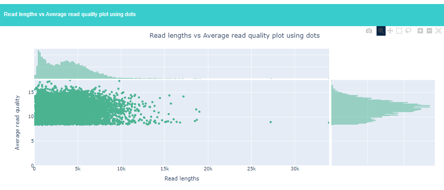

<br>This graph shows no discernable correlation between read quality and read length. It was expected to show shorter reads with lower quality, and longer reads with higher quality. What it does show is that there is indeed an arbitrary quality cutoff between 7 and 10 (approximately >8). 

--------------------------------------------------
--------------------------------------------------

# 4: Taxonomy - unmodified classification

Before the data is further edited based on quality control, it is important to see the final results on the unedited data first, otherwise there is no reference for the edited data later. In this section, the raw data (SW.fastq.gz) will be used as input for taxonomic analysis. Taxonomy will be done using the Kraken2 tool, which uses *k*-mer analysis from large genome databases in order to assign reads to specific species. The reference genome databases can be quite large, which is why there are various smaller databases available which require less processing power and disk space. This comes with the drawback that more reads end up labeled as unclassified. For this project, the *kraken2_classifier.sh* script is written in such a way that it allows the user to choose which database should be used. The script can be executed as follows:

```{bash Kraken2 08gb, eacho=TRUE, eval=FALSE}

# print the Kraken2 tool description (optional):

kraken2 -h

# print the kraken2_classifier.sh script function and usage (optional):

bash scripts/kraken2_classifier.sh -h

# execute the script with proper flags (use a clear and descriptive output directory name, in this case "SW_08"):

bash scripts/kraken2_classifier.sh \
-i raw_data/SW.fastq.gz            \ 
-O analyse/kraken2/SW_08

# to follow along with this RMarkdown example, choose **'1'** when prompted to use the 8GB mini-kraken database.

# move the downloaded database to the reference folder and rename to keep files structured:

mv analyse/kraken2/SW_08/kraken2_db referentie
mv referentie/kraken2_db referentie/kraken2_db_08gb

```

<br>The script will save the results to the newly made analyse/kraken2 folder. The "SW.report" file shows the complete taxonomy of all reads in the input file, with representation in percentages (%) in the first column. The overall percentages of classified and unclassified ("U") reads can be seen in the first two lines of this document. 

```{bash Kraken2 08gb cat, echo=TRUE, eval=TRUE}

cat analyse/kraken2/SW_08/SW_08.report | head -n2

```

The k-mer analysis could identify 20.60% of the reads. The input for this analysis was the complete raw dataset without data manipulation (except probably >8 Phred-score cutoff) or any other form of filtering. To increase the rate if identification is to increase the efficacy of this pipeline -- therefore the adjustment of certain key parameters must be explored to increase the rate of taxonomic classification of the metagenomic samples. The following options will thus be tested:
<br><br>1: expand the Kraken2 reference database in order to identify more reads originating from microbes not represented by the 8GB mini-database;
<br>2: increase the minimum Phred-quality score threshold (above 8);
<br>3: introduce targeted ONT-adapter trimming;
<br>4: filter on read length.
<br><br>Classification rates from before and after these parameter adjustments will be compared. 

--------------------------------------------------
--------------------------------------------------

# 5: Taxonomy - parameter adjustments

### 5.1: expanding the Kraken2 reference database

As a first step, the *kraken2_classifier.sh* script will rerun using a larger reference database, from 8gb to 16gb. The script is run similarly to the previous run:

```{bash Kraken2 16gb, echo=TRUE, eval=FALSE}

# run the kraken2 script but choose the 16gb reference database (use a clear and descriptive output directory name, in this case "SW_16"):

bash scripts/kraken2_classifier.sh -i raw_data/SW.fastq.gz -O analyse/kraken2/SW_16

# choose option **'2'** to download and use the 16gb reference database.

# once the taxonomic analysis is finisched, move the downloaded database to the reference folder and rename the file:

mv analyse/kraken2/SW_16/kraken2_db referentie
mv referentie/kraken2_db referentie/kraken2_db_16gb

```

<br>View the the first two lines (with the overall classification rates) of the new analysis:

```{bash Kraken2 16gb cat, echo=TRUE, eval=TRUE}

cat analyse/kraken2/SW_16/SW_16.report | head -n2

```

<br>Using the larger reference database, the rate of classification has increased from 20.60% to 29.90%. This shows that using a larger database allows the k-mer analysis to match more of the previously unclassified reads to known species, as expected. It is therefore recommended to use larger references for taxonomic classification. These databases do however take up a lot of space and it is recommended to check the server capacity before choosing to download a larger database.

### 5.2: increasing the minimum Phred-quality score threshold

Reads with low quality scores that cannot be confidently classified by Kraken2 remain unclassified after k-mer analysis (this also depends on Kraken2 confidence threshold discussed later). To filter reads on minimum average quality, the NanoFilt tool is used which can accept fastq.gz files and filter out low quality reads. The threshold can be provided by the user as follows.

```{bash NanoFilt Q10, echo=TRUE, eval=FALSE}

# activate conda environment with NanoFilt:

conda activate nanofilt_env

# run nanofilt_qfilter script:

bash scripts/nanofilt_qfilter.sh \
-i raw_data/SW.fastq.gz          \
-O bewerkte_data/SW_Q10

# when prompted, enter "10" to filter reads on a minimum average Phred-score of 10.

# return to main environment:

conda activate meta

```

<br>In this case, the fastq file has reduced in size from 3.3 tot 2.7 GB indicating substantial read filtering. To check whether the reads have been properly filtered, run the NanoPlot script using the new dataset as input:

```{bash NanoPlot Q10, echo=TRUE, eval=FALSE}

# execute fastq_nanoplotter.sh on new Q>10 dataset:

bash scripts/fastq_nanoplotter.sh \
-I bewerkte_data/SW_Q10           \
-O analyse/nanoplot

# compare the results (analyse/nanoplot/) before and after >Q10 filtering.

```

<br>According to the NanoPlot summary, filtering out 253220 reads (932671-679451) has raised the mean read quality from 10.8 to 11.5, with 100% of reads >Q10. The new read length vs read quality plot supports the >Q10 cutoff.

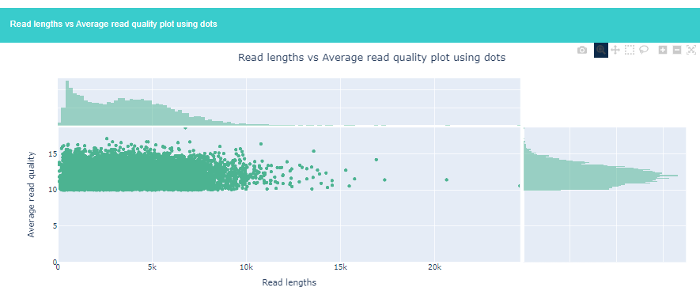

<br><br>Repeat Kraken2 analysis using *kraken2_classifier.sh*, with the 16gb reference database and output to analyse/kraken2/SW_Q[..]. Then repeat the *NanoFilt > Kraken2 > NanoPlot* analysis for Q>12, Q>16 and Q>20. The results of these different runs are presented in *table 1*.<br><br> 


### 5.3: ONT-adapter trimming

<br>The next option to improve Kraken2 output is to detect and remove specific ONT adapters that may have been used in sample preparation. In the SW case, there is no documentation available with regards to adapter sequences. The **Porechop** tool uses a library of known ONT adapter sequences and once found, trims these off the sequences in an attempt to raise the average quality of the read and thus make taxonomic classification more reliable. Porechop can be used as follows:

```{bash Porechop adapter trimming, echo-TRUE, eval=FALSE}

# print the Porechop description (optional):

porechop -h

# execute Porechop with proper flags, using the SW_Q10 as input:

porechop                                      \
-i bewerkte_data/SW_Q10/SW_Q10.fastq.gz       \
-o bewerkte_data/SW_Q10_PC/SW_Q10_PC.fastq.gz

```

<br>Porechop progress can be viewed in the terminal while the tool is running. In this particular case, at least 655450 out of 769451 reads have been edited by Porechop:

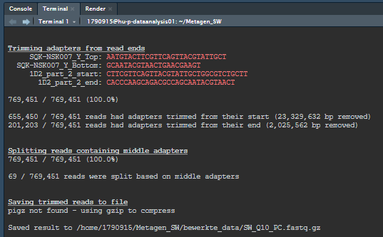

<br>Since many reads have been trimmed, it is important to check whether there are not too many short reads in the new dataset. Use FastQC to check the read lengths:

```{bash FastQC SW_Q10_PC, echo=TRUE, eval=FALSE}

# run the fastqc_reporter script on SW_Q10_PC:

bash scripts/fastqc_reporter.sh \
-I bewerkte_data/SW_Q10_PC      \
-O analyse/fastqc

```


<br>To double-check the surprising quality results, another NanoPlot analysis is done on this subset:

```{bash NanoPlot SW_Q10_PC, echo=TRUE, eval=FALSE}

# run the fastq_nanoplotter.sh script on SW_Q10_PC:

bash scripts/fastq_nanoplotter.sh \
-I bewerkte_data/SW_Q10_PC        \
-O analyse/nanoplot

```

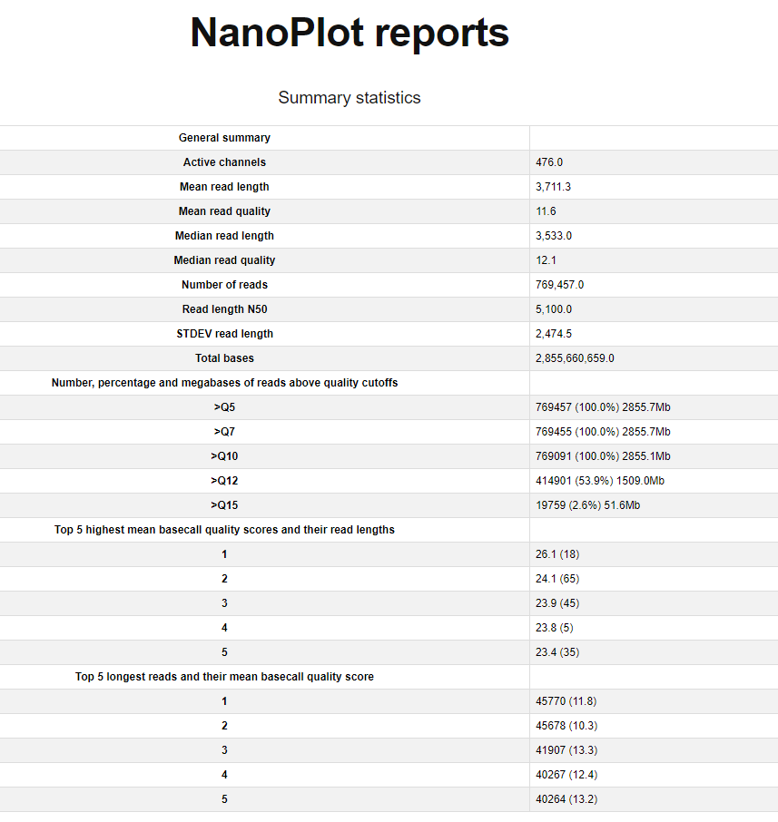

<br>The nanoplot summary shows that the quality boxplots in the FastQC report are deceptive. The very high quality scores as seen in 'Top 5 highest mean basecall quality scores and their read lengths' each correspond to very short reads (6-65 bases).

The Kraken2 analysis on this data shows classification rates comparable to the Q>10 data without adapter filtering with Porechop. However it is still recommended to trim known adapter sequences (from ONT, depending on experimental design) as these subsequences are non-relevant data for most experiments.

### 5.4: filtering on read length

To remedy the problem of very short reads, the data can be filtered on minimum read length. Nanopore is designed to generate long sequences, and with relatively low quality scores compared to Illumina, very short Nanopore reads can easily be misidentified during *k*-mer analysis. The NanoFilt tool can be used for this purpose, too.  

```{bash NanoFilt read lengths, echo=TRUE, eval=FALSE}

# activate conda environment with NanoFilt:

conda activate nanofilt_env

# run nanofilt_lfilter script:

bash scripts/nanofilt_lfilter.sh              \
-i bewerkte_data/SW_Q10_PC/SW_Q10_PC.fastq.gz \
-O bewerkte_data/SW_Q10_PC_L

# when prompted, enter "1000" for minimum read length. 
# press enter for maximum read length to skip that option.

# return to main environment:

conda activate meta

```

<br>Kraken2 analysis on this subset, with minimum read lengths of 1000 bases, shows an increase in classification rates:

```{bash Kraken2 SW_Q10_PC_L1000, echo=TRUE, eval=TRUE}

cat analyse/kraken2/SW_Q10_PC_L/SW_Q10_PC_L1000.report | head -n2

```

<br>This process can be repeated any number of times to generate new subsets with different read length requirements. For testing purposes, different minimum and maximum length requirements will be combined, and the output of each will be used as input for Kraken2. To get an understanding of which min-max parameters are worth testing while retaining a relevant amount of reads, the read length histogram from the NanoPlot analysis on SW_Q10_PC can be used.

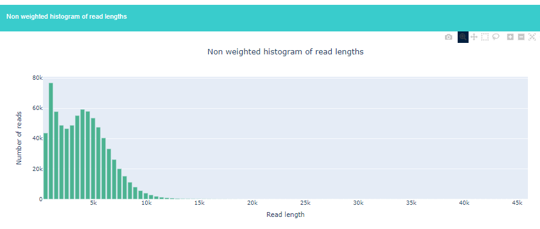

<br>After testing multiple combinations, these are the results:

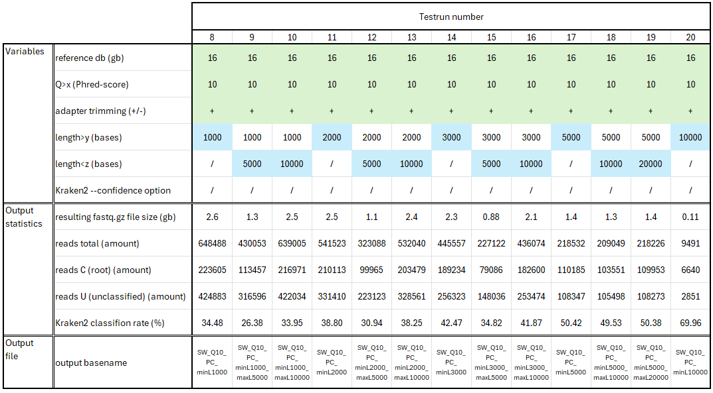

<br>These results show that higher minimum length requirements generate subsets with higher rates of classification using *k*-mer analysis. The maximum length limit does not appear to increase classification. For the purposes of this pipeline, the subset SW_Q10_PC_minL5000 will be used for downstream analysis, as this subset has a relatively high percentage of classified reads (50.42%) while retaining 218532 reads, as opposed to SW_Q10_PC_minL10000 which has 69.96% classified but only retained 9491 reads.

--------------------------------------------------
--------------------------------------------------

# 6: Abundance estimation

To give a better representation of the actual microbial composition of the sample, the Kraken2 output is used as input for the Bracken tool, which re-estimates species abundances using Bayesian algorithms.

```{bash Bracken abundance estimation, echo=TRUE, eval=FALSE}

# print the bracken_estimator.sh script function and usage (optional):

bash scripts/bracken_estimator.sh -h

# execute bracken_estimator.sh with proper flags:

bash scripts/bracken_estimator.sh                         \
-i analyse/kraken2/SW_Q10_PC_L5000/SW_Q10_PC_L5000.report \
-O analyse/bracken/SW_Q10_PC_L5000                        \
-d referentie/kraken2_db_16gb/

```

--------------------------------------------------
--------------------------------------------------

# 7: Visualization of microbial composition

Finally, the Bracken results can be used as input for the *Krona* tool for visualizing metagenomic data results. The Krona tool can be utilized as follows:

```{bash Krona visualization, echo=TRUE, eval=FALSE}

# print the krona_visualizer.sh script function and usage (optional):

bash scripts/krona_visualizer.sh -h

# use the krona_visualizer.sh script to create a Krona taxonomy chart:

bash scripts/krona_visualizer.sh \
-i analyse/bracken/SW_Q10_PC_L5000/SW_Q10_PC_L5000_bracken_species.report \
-O analyse/krona/SW_Q10_PC_L5000

```

<br>The graph is interactive and can be studied to find specific species and their abundance in the environment at the time the original metagenomic samples were abstracted. This is purely a visual aid -- any particular species of interest can also searched for using ctrl+F in the bracken report file (analyse/bracken/SW_Q10_PC_L5000/SW_Q10_PC_L5000_bracken_species.report).

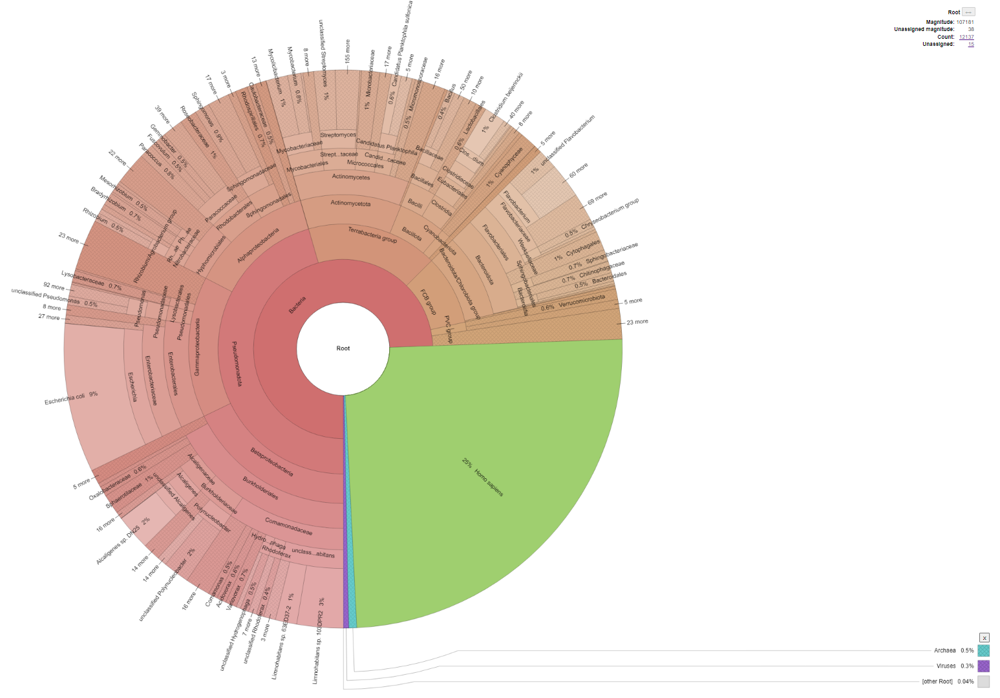

<br>Note that in this case, a large portion (25%) of the sample consists of human DNA ('*Homo sapiens*'). This indicates contamination of the samples with human DNA, which should be taken into consideration when forming conclusions based on this data, because certain bacterial or viral classifications may also have been introduced through this contamination -- passed on from human skin, sweat, et cetera to the samples during preparation or sequencing. Note that for samples originating from the human gut, for example, a large amount of human host DNA is expected and should not necessarily be regarded as contamination, but as a byproduct of experimental design.

Since the graph is interactive, clicking on the 'Bacteria' tag on the innermost circle shifts the graph to only show bacterial classifications. The same works for other taxa, so that a selection can be presented based research purposes and questions.

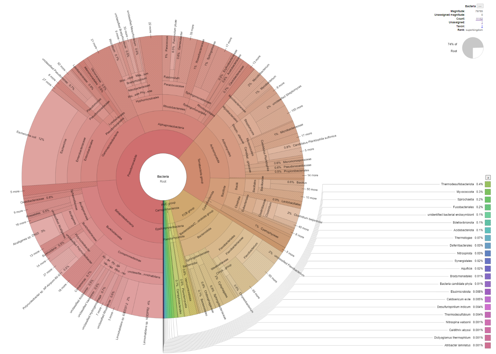

--------------------------------------------------
--------------------------------------------------

# 8: Validation

A positive and a negative control will be supplied as input for this final pipeline. These tests must validate whether reads are correctly classified during Kraken2 analysis. The SW test data cannot be used for this purpose since it is only a test sample without a definitive hypothesis with regards to the microbial composition.

### 8.1: Positive control

The positive control will use genomic FASTQ data from Escherichia coli O157:H7. If the input consists of genomic data only from this strain, the Kraken2 report is expected to reflect this by classifying reads only as E. coli O157:H7 strain, or more generally as the E. coli species in the case of homologous sequences shared between strains. This species and strain is chosen as it is represented in the Krona chart, and included in the 16 Gb database. Besides, E. coli has multiple identified strains, so the results of this positive control might also give an indication of the pipeline's specificity during classification.

### 8.2: Positive control workflow

8.2.1: Preparation:
<br>8.2.1.1: NCBI https://www.ncbi.nlm.nih.gov/
<br>8.2.1.2: select database: SRA
<br>8.2.1.3: search "Escherichia coli O157:H7 nanopore"
<br>8.2.1.4: choose "WGS of Escherichia coli O157" with SRX4347297
<br>8.2.1.5: note run SRR7477813

8.2.2: Get data:
<br>8.2.2.1: fastq-dump SRR7477813
<br>8.2.2.2: mv SRR7477813.fastq control
<br>8.2.2.3: gzip control/SRR7477813.fastq

8.2.3: Perform control:
<br>8.2.3.1: raw fastqc
<br>      bash scripts/fastqc_reporter.sh -I control -O analyse/fastqc/SRR7477813
<br>8.2.3.2: raw nanoplot
<br>      bash scripts/fastq_nanoplotter.sh -I control -O analyse/nanoplot/SRR7477813
<br>8.2.3.3: unmodified taxonomy
<br>      bash scripts/kraken2_classifier.sh -i control/SRR7477813.fastq.gz -O analyse/kraken2/SRR7477813
<br>      (option 5: referentie/kraken2_db_16gb)
<br>8.2.3.4: data manipulation
<br>      conda activate nanofilt_env
<br>        bash scripts/nanofilt_qfilter.sh -i control/SRR7477813.fastq.gz -O control
<br>        (option: Q>10)
<br>      conda activate meta
<br>        porechop -i control/SRR7477813_Q10.fastq.gz -o control/SRR7477813_Q10_PC.fastq.gz
<br>      conda activate nanofilt_env
<br>        bash scripts/nanofilt_lfilter.sh -i control/SRR7477813_Q10_PC.fastq.gz -O control
<br>        (option: min 5000; max none)
<br>      conda activate meta
<br>8.2.3.5: new kraken
<br>      bash scripts/kraken2_classifier.sh -i control/SRR7477813_Q10_PC_minL5000.fastq.gz -O analyse/kraken2/SRR7477813_Q10_PC_L5000
<br>8.2.3.6: bracken
<br>      bash scripts/bracken_estimator.sh -i analyse/kraken2/SRR7477813_Q10_PC_L5000/SRR7477813_Q10_PC_L5000.report -O analyse/bracken/SRR7477813_Q10_PC_L5000 -d referentie/kraken2_db_16gb/
<br>8.2.3.7: krona
<br>      bash scripts/krona_visualizer.sh -i analyse/bracken/SRR7477813_Q10_PC_L5000/SRR7477813_Q10_PC_L5000_bracken_species.report -O analyse/krona/SRR7477813

Cleanup:
mkdir control/control_pos
mv control/SRR* control/control_pos

### 8.3: Positive control results

Before data manipulation:
<br>Classified 84.75%; 
<br>E. coli (species) 43.47; 
<br>E. coli O157:H7 (strain) 2.17% with many different subtypes.

After data manipulation:
<br>Classified 100%; 
<br>E. coli (species) 96.69%; 
<br>E. coli O157:H7 (strain) 12.36% with many different subtypes.

After Bracken:
<br>Enterobacteriaceae (family; 100%), of which:
<br>E. coli (species) 98.22%; 
<br>Other Escherichia species (fergusonii 0.24%, albertii 0.20%, marmotae 0.13%, Escherichia sp. E4742 0.11%, unclassified Escherichia 0.11%; 
<br>Other genus (Shigella 0.51%, Klebsiella 0.20%, Salmonella 0.16%, Enterobacter 0,07%, Citrobacter 0.07%, Kluyvera 0.04%, Leclercia, 0.02%, Superficieibacter 0.02%.

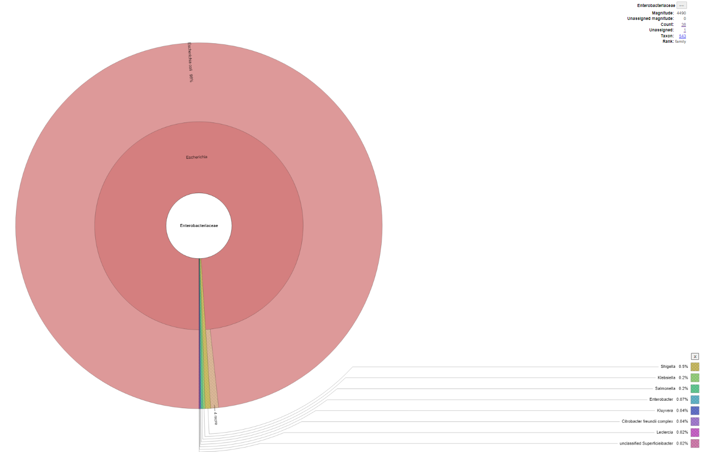

### 8.4: Negative control

The negative control will make use of Nanopore shotgun sequencing data from Candidatus Chlorohelix allophototropha, a bacterial strain found in hot springs, that is not represented in the 16 GB reference database.

### 8.5: Negative control workflow

8.5.1: Preparation:
<br>8.5.1.1: NCBI https://www.ncbi.nlm.nih.gov/
<br>8.5.1.2: select database: SRA
<br>8.5.1.3: search "nanopore Chlorohelix allophototropha"
<br>8.5.1.4: choose "Shotgun genome sequencing (Nanopore) of "Ca. Chlorohelix allophototropha": single colony from subculture 19.9" with SRX20809890
<br>8.5.1.5: note run SRR25055608

8.5.2: Get data:
<br>8.5.2.1: fastq-dump SRR25055608
<br>8.5.2.2: mv SRR25055608.fastq control
<br>8.5.2.3: gzip control/SRR25055608.fastq

8.5.3: Perform control:
<br>8.5.3.1: raw fastqc
<br>      bash scripts/fastqc_reporter.sh -I control -O analyse/fastqc/SRR25055608
<br>8.5.3.2: raw nanoplot
<br>      bash scripts/fastq_nanoplotter.sh -I control -O analyse/nanoplot/SRR25055608
<br>8.5.3.3: unmodified taxonomy
<br>      bash scripts/kraken2_classifier.sh -i control/SRR25055608.fastq.gz -O analyse/kraken2/SRR25055608
<br>      (option 5: referentie/kraken2_db_16gb)
<br>8.5.3.4: data manipulation
<br>      conda activate nanofilt_env
<br>        bash scripts/nanofilt_qfilter.sh -i control/SRR25055608.fastq.gz -O control
<br>        (option: Q>10)
<br>      conda activate meta
<br>        porechop -i control/SRR25055608_Q10.fastq.gz -o control/SRR25055608_Q10_PC.fastq.gz
<br>      conda activate nanofilt_env
<br>        bash scripts/nanofilt_lfilter.sh -i control/SRR25055608_Q10_PC.fastq.gz -O control
<br>        (option: min 5000; max none)
<br>      conda activate meta
<br>8.5.3.5: new kraken
<br>      bash scripts/kraken2_classifier.sh -i control/SRR25055608_Q10_PC_minL5000.fastq.gz -O analyse/kraken2/SRR25055608_Q10_PC_L5000
<br>8.5.3.6: bracken
<br>      bash scripts/bracken_estimator.sh -i analyse/kraken2/SRR25055608_Q10_PC_L5000/SRR25055608_Q10_PC_L5000.report -O analyse/bracken/SRR25055608_Q10_PC_L5000 -d referentie/kraken2_db_16gb/
<br>8.5.3.7: krona
<br>      bash scripts/krona_visualizer.sh -i analyse/bracken/SRR25055608_Q10_PC_L5000/SRR25055608_Q10_PC_L5000_bracken_species.report -O analyse/krona/SRR25055608

Cleanup:
mkdir control/control_neg
mv control/SRR* control/control_neg

### 8.6: Negative control results

There are still reads being classified to other species in the reference database. This shows that the used parameters might not be strict enough, or that species with a low percentage of classifications should be disregarded. This is a point of further investigation. While the expectation was that none of the reads would be classified, it does not necessarily mean that all read classifications are wrong. It is still possible that the sequencing data was contaminated, just like the positive control containing few reads of other species. With this negative control, however, there is of course no one species that has by far the most reads like the E. coli in the positive control. This is discussed further in chapter 10.1.


### 8.4: Negative control using nonsense data

Another attempt is made to execute a negative control, this time using randomly generated nonsense data using the *nanopore_generator.sh* script. 17 reads of varying lengths and average quality scores between 10 and 13 have been randomly generated as nonsense_nanopore.fastq.gz. This file has been used as input for the pipeline as shown before. Out of 17, 12 reads passed through the filtering steps but 0 of the reads ended up being classified with Kraken2 analysis. This is something to also look into further, with a much larger nonsense input.

--------------------------------------------------
--------------------------------------------------

# 9: Pipeline overview and conclusions

This pipeline has been created for analyzing microbial composition in metagenomic samples. It has been written for users with limited to no scripting or command line experience. The pipeline includes directory and Conda environment setups, raw data selection, quality control, data manipulation based on intermediate results, taxonomic classification, visualization, and validation with positive and negative controls. With regards to the pipeline variables, the highest rate of classification using Kraken2 were as follows:
<br>Kraken 2 reference database: 16GB (larger is better);
<br>Porechop is used to remove adapter sequences (preferable regardless of classification percentage);
<br>Quality filtering with Phred-scores > 10;
<br>Minimum length filtering of 5000 bases;
<br>No maximum length filtering.

The positive control worked well, classifying 100% of reads after data manipulation and assigning 98% to E. coli after Bracken abundance estimation, with 100% to E. coli's family group Enterobacteriaceae. It does however show this pipeline should be used at most for identification on the genus level instead of the species level, as species information is lost after Bracken analysis.

The negative control left much to be desired. An unexpectedly large amount of reads was still assigned to species while the input should only contain data from a single species that is not represented in the reference database. 


--------------------------------------------------
--------------------------------------------------

# 10: Considerations and future improvements

### 10.1: issues with regards to negative control results

The negative control showed that there are still many reads being classified while using genomic data from a species that is not represented in the reference database. This suggests that the Kraken2 analysis is not strict enough. It is recommended to try other unrepresented species as well, to check whether the chosen experimental data is not just contaminated. It would be good to also make use of the Kraken2 --confidence option which raises the minimum confidence threshold before classifying each read. Besides that, the resulting analysis could be explored more, whether there should be a minimum amount of classified reads per species, so that species with very few reads or a very low percentage of reads may be disregarded. This will require more knowledge about k-mer analysis and more testing of variables.

### 10.2: exploring more taxonomy options

While Kraken2 is a popular tool for classification, it was preferred to use multiple different tools and methods for taxonomic profiling of the data. That way the results could be compared. While for other steps in the pipeline different tool options have been explored, this crucial step has not yet been done for the purpose of classification and taxonomy. There are other tools such as Kaiju and Centrifuge that could be used for this purpose as well.

### 10.3: human host removal

There have been many attempts to remove the human reads from the SW samples. This has been attempted using tools that, in other cases, can identify human reads as 'host DNA' and remove them. The used tools are BowTie2, Minimap2 and again Kraken2 using a human genome as reference database and then selecting only the unclassified reads as output. Unfortunately none of these methods has provided a satisfying result. Eventually it was decided to leave the human samples in the data, and provide a warning for if there are many human reads in a sample, this might mean contamination of the sample. That also would mean that the sample may contain genomic material of microbes that may be residing on the human skin before or during sequencing. It is recommended to explore options in the future, and attempt to remove the human data from the Kraken2 output and recalculate percentages of all other present microbes and organisms through scripting, so that no other tools or reference databases need to be used.

### 10.4: improving user experience

While the pipeline should be understandable for users with little to no experience, some aspects of the pipeline are still undesirable. For example, the kraken2_classifier.sh script requires the user to enter the path to the reference database which may not be easy for everyone.